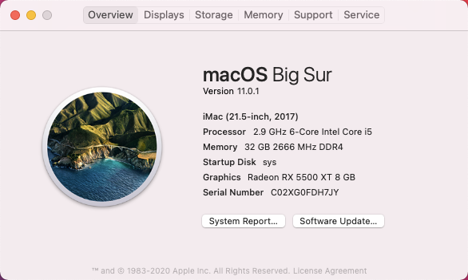

# Hackintosh-10400-Gigabyte-H410MH
i5-10400 + Gigabyte H410M H +  AMD Radeon RX 5500 XT + Big Sur + OpenCore 0.6.3

# Info PC
```
Main: GIGABYTE H410M H
CPU: Intel® Core™ i5-10400
Ram: 32GB (2x16GB - 2666) Gloway Type-α
VGA: ASROCK Radeon RX 5500 XT
SSD: Gloway VAL 480GB
```

# OpenCore(0.6.3)

- https://dortania.github.io/OpenCore-Desktop-Guide

# Result


